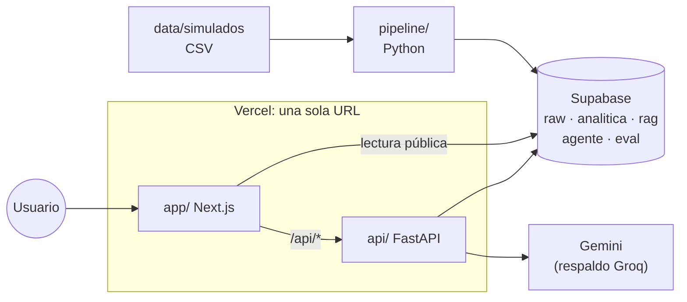
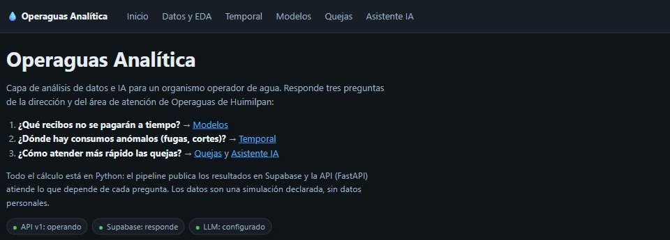
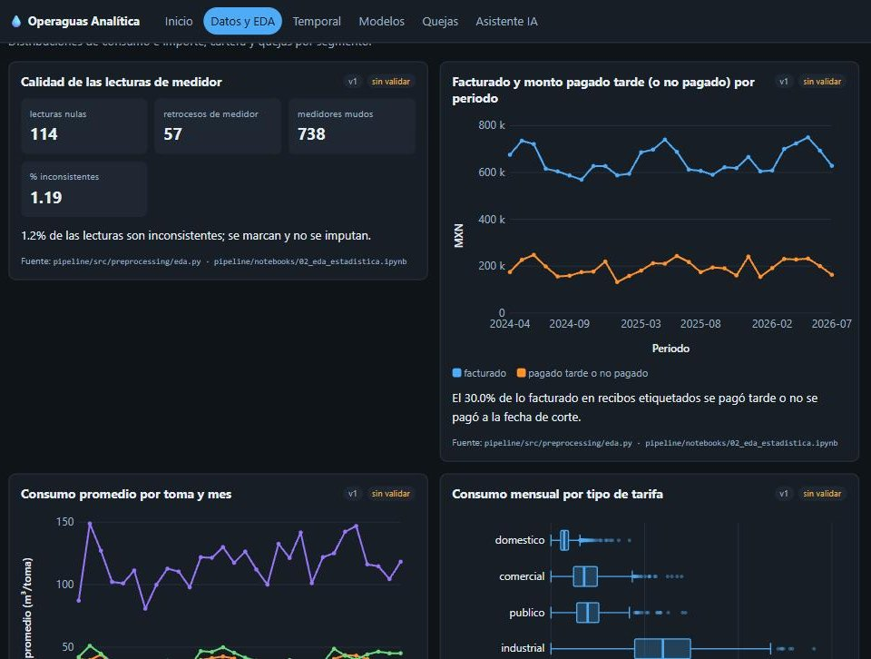
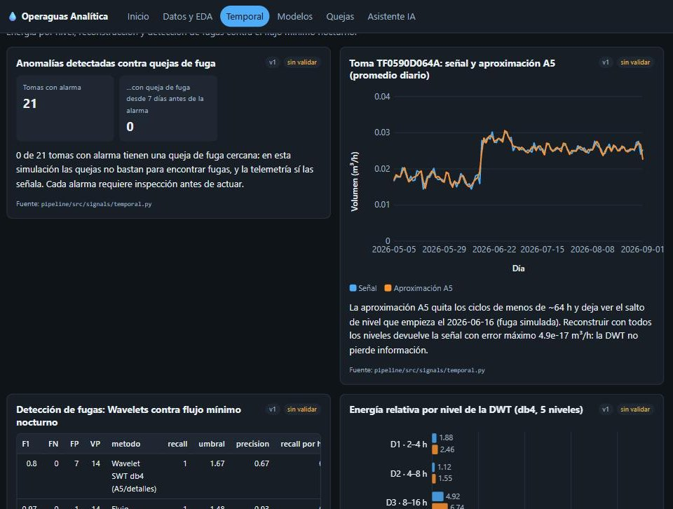
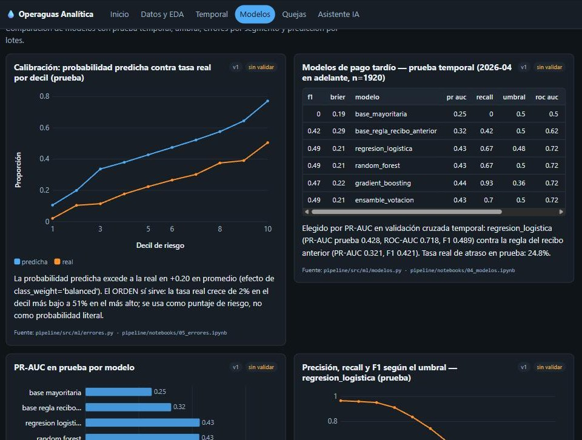
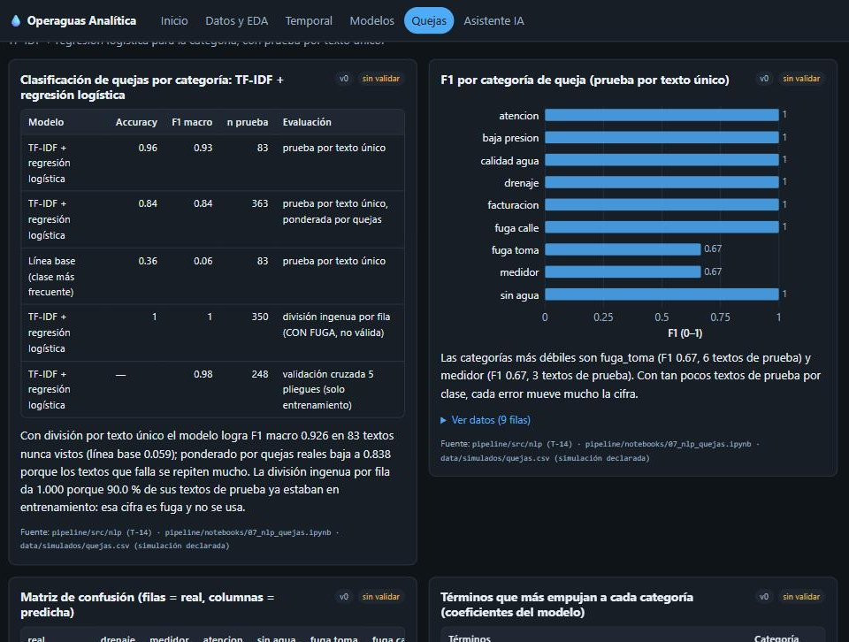
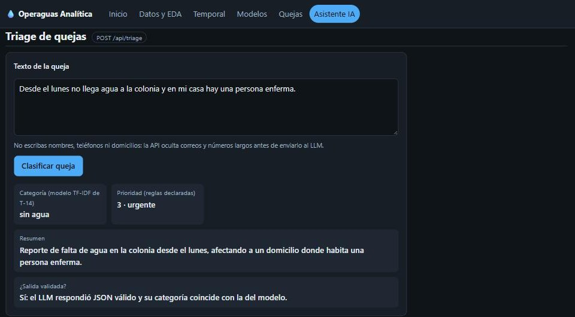

# Operaguas Analítica

Análisis de datos e IA para un organismo operador de agua: anticipa recibos que se pagarán
tarde, detecta consumos anómalos (fugas) y acelera la atención de quejas.

**Proyecto final del Diplomado de Python y Análisis de Datos — Universidad Marista, 2026.**

**App desplegada:** https://operaguas-analitica.vercel.app ·
**Estado de la API:** https://operaguas-analitica.vercel.app/api/salud ·
**Documentación de la API:** https://operaguas-analitica.vercel.app/api/docs

> Las cifras no se copian en este README (regla del proyecto: ninguna métrica se escribe a
> mano). Cada resultado vive en `analitica.resultados_vigentes` (Supabase), se genera con
> código y semilla 42, y se ve en la app con su conclusión y su fuente.

---

## 1. Nombre

**Operaguas Analítica.**

## 2. Integrantes

- Emilio Rico Hernández: dueño del producto y analista; validación de conclusiones; despliegue.
- Andrés Rodríguez Morales: datos simulados, app, IA generativa y pruebas.

## 3. Problema

Operaguas de Huimilpan (Querétaro) opera el servicio de agua de sus usuarios. Tiene tres problemas:

1. **Cartera:** no sabe con anticipación qué recibos se pagarán tarde.
2. **Pérdidas:** las fugas y los consumos anómalos se descubren tarde, con frecuencia por una queja.
3. **Atención:** las quejas llegan como texto libre por varios canales y se clasifican y priorizan a mano.

**Usuarios:** la dirección (cartera y pérdidas) y el área de atención (quejas).

## 4. Objetivo

Construir una aplicación desplegada en la nube que integre análisis de datos, estadística, series
de tiempo, machine learning, deep learning, NLP, LLM, RAG, agentes, Fourier y Wavelets. Cada
técnica debe responder alguna de las tres preguntas y tener una métrica reproducible.

## 5. Arquitectura



- `pipeline/` hace todo el trabajo pesado (pandas, scikit-learn, PyTorch, PyWavelets) **fuera de
  Vercel** y publica cada resultado como un `payload` JSON.
- `app/` (Next.js) solo presenta: un componente único dibuja cualquier resultado.
- `api/` (FastAPI) atiende lo que depende de la pregunta del usuario: triage, RAG, agente,
  cálculo de importe y salud.

Detalle, flujo de cada consulta y límites: [`docs/arquitectura.md`](docs/arquitectura.md).

## 6. Stack

| Capa | Tecnología |
|---|---|
| Datos y modelos | Python 3.11, pandas, NumPy, SciPy, statsmodels, scikit-learn, PyTorch, PyWavelets |
| NLP e IA | TF-IDF + regresión logística, LSA, Gemini (LLM y embeddings de 768 dimensiones), Groq de respaldo |
| API | FastAPI + Pydantic en funciones Python de Vercel; httpx |
| Web | Next.js 16 (App Router, ISR), React 19, TypeScript; gráficas en SVG propio |
| Base de datos | Supabase (Postgres, pgvector, RLS), esquemas `raw`, `analitica`, `rag`, `agente`, `eval` |
| Pruebas | pytest (pipeline y API, sin red), `node:test` (validación de payloads) |

## 7. Fuente de datos

**Simulación declarada** que reproduce la estructura del sistema de Operaguas (tomas, lecturas,
recibos, telemetría horaria y quejas), **sin datos personales**: los IDs son cifrados. Detalle y
reglas de uso en [`data/README.md`](data/README.md).

- Hay columnas prohibidas como variables, para evitar fuga de información: `pipeline/src/config.py`.
- El generador original no se conservó (T-00c). La reproducibilidad parte de los CSV versionados
  y de `python -m pipeline.run_all`.

## 8. Módulos de la app

| Página | Qué responde |
|---|---|
| **Inicio** | Problema, estado en vivo de la API (`/api/salud`) y estado de cada módulo |
| **Datos y EDA** | Pipeline de limpieza, análisis exploratorio y pruebas estadísticas |
| **Temporal** | Series de tiempo, Fourier y Wavelets (detección de fugas) |
| **Modelos** | Pago tardío (comparación, umbral, errores), segmentación, deep learning y calculadora de importe |
| **Quejas** | Clasificación de quejas y búsqueda de quejas similares |
| **Asistente IA** | Triage con LLM, preguntas a documentos (RAG) y agente con herramientas |

Cada tarjeta muestra título, gráfica o tabla, **conclusión**, versión, si ya la validó una persona
y el archivo de **origen**.

## 9. Modelos

- **Pago tardío** (`pipeline/src/ml/modelos.py`): se comparan una línea base mayoritaria, la regla
  del recibo anterior, regresión logística, random forest, gradient boosting y un ensemble por
  votación. Todos son `Pipeline` de scikit-learn con validación cruzada **temporal**
  (`TimeSeriesSplit` por periodo) y prueba con los meses más recientes. Se elige por PR-AUC y se
  predice por lotes en `analitica.predicciones_pago`.
- **Segmentación** (`pipeline/src/ml/segmentos.py`): K-means + PCA sobre el comportamiento de consumo y pago de cada toma.
- **Deep learning** (`pipeline/src/deep_learning/mlp.py`): MLP en PyTorch contra gradient boosting.
- **Quejas** (`pipeline/src/nlp/clasificador.py`): TF-IDF + regresión logística. Se evalúa separando por
  **texto único** para no inflar la métrica con textos repetidos.

## 10. Métricas

| Tema | Métrica | Dónde verla |
|---|---|---|
| Pago tardío | PR-AUC, ROC-AUC, F1, precisión y recall por umbral, calibración | /modelos · `ml/*` |
| Segmentación | Silhouette por K, varianza explicada | /modelos · `clustering/*` |
| Deep learning | PR-AUC del MLP contra gradient boosting, curva de pérdida | /modelos · `dl/*` |
| Series | MAE del pronóstico contra el ingenuo y el ingenuo estacional | /temporal · `series/prediccion_mensual` |
| NLP | F1 macro contra línea base y contra la división ingenua | /quejas · `nlp/*` |
| Embeddings | precision@5 de quejas similares | /quejas · `embeddings/similitud_precision5` |
| LLM | Formato válido, acuerdo LLM–modelo, latencia | /asistente · `llm/*` (`python -m pipeline.src.nlp.evaluar_llm`) |
| RAG | Recall@1/3/5, MRR y abstención correcta | /asistente · `rag_eval/*` (`python -m pipeline.src.rag.evaluar`) |
| Agente | Tool Selection Accuracy y éxito de tareas | /asistente · `agente_eval/*` (`python -m pipeline.src.agents.evaluar`) |

Mapa completo bloque → código → notebook → resultado → página: [`docs/trazabilidad.md`](docs/trazabilidad.md).

## 11. Fourier y Wavelets

Ambos se aplican a la telemetría horaria de 40 tomas (`pipeline/src/signals/temporal.py`, notebook 03).

- **Fourier:** FFT del consumo horario, espectro de potencia, frecuencias dominantes convertidas a
  periodo (p. ej. el ciclo de 24 h) y filtrado/reconstrucción con los picos principales. Un pico
  espectral indica una **periodicidad**, no una causa.
- **Wavelets:** DWT `db4` de 5 niveles con energía por nivel y reconstrucción sin pérdida. Además,
  un detector de fugas que compara la energía de la aproximación contra los detalles. Se compara
  con el método clásico de flujo mínimo nocturno, con un umbral fijado **sin etiquetas**. La
  sensibilidad al umbral se reporta aparte.

## 12. LLM, RAG y agentes

- **LLM (triage)** (`api/_lib/triage.py`):
  - La **categoría** la da el clasificador de NLP (exportado a Python puro) y la **prioridad** sale de reglas declaradas (`api/_lib/prioridad.py`).
  - El LLM solo **redacta el resumen** y señala riesgo, con salida JSON validada por Pydantic, 1 reintento y respaldo Groq.
  - Antes de enviar el texto se ocultan correos y números largos.
  - Si el LLM falla, el triage responde igual con `valido: false`.
- **RAG** (`pipeline/src/rag/`, `api/_lib/rag.py`):
  - Corpus: tarifario CEA, reglas del recibo y documentación del proyecto.
  - Chunking de 900 caracteres con solape de 150, embeddings de 768 dimensiones y búsqueda Top-k en pgvector.
  - Si ninguna similitud supera el umbral, responde `evidencia: false` **sin llamar al LLM**. Si hay evidencia, el LLM debe citar los fragmentos y la app muestra las **fuentes**.
- **Agente** (`api/_lib/agente/`):
  - Cinco herramientas: estado de cuenta, cálculo de importe, predicción de pago, búsqueda en documentos y análisis de la serie.
  - Argumentos validados, dispatcher que devuelve los errores al LLM, **límite de 5 pasos** y bitácora de cada paso en `agente.log`.
  - Resuelve tareas de varios pasos, por ejemplo "¿cuánto debe esta toma y pagará a tiempo?".

## 13. Instrucciones de desarrollo

```bash
# 1. Pipeline (Python 3.11)
python -m venv .venv && source .venv/bin/activate
pip install -r pipeline/requirements.txt
python -m pipeline.run_all            # reconstruye resultados desde data/simulados/
pytest                                # pruebas sin red

# 2. API local
pip install -r requirements.txt uvicorn
npm run api:dev                        # FastAPI en 127.0.0.1:8000 (docs en /api/docs)

# 3. Web local
npm install
RESULTADOS_MUESTRA=1 npm run dev       # :3000; /api/* se reenvía a :8000; datos de muestra
npm test && npm run typecheck && npm run build

# 4. RAG y evaluaciones (requieren .env con llaves)
python -m pipeline.src.rag.indexar                 # corpus → embeddings → rag.fragmentos
python -m pipeline.src.nlp.evaluar_llm --subir     # bloque L
python -m pipeline.src.rag.evaluar --subir         # bloque M (preguntas validadas)
python -m pipeline.src.agents.evaluar --url https://operaguas-analitica.vercel.app --subir  # bloque N

# 5. Reporte técnico
python docs/reporte/generar.py         # → reporte_tecnico.md/.html (PDF con Chrome)
```

**Despliegue:** el proyecto de Vercel está conectado a `main` y cada merge despliega a producción.
`next.config.ts` reenvía `/api/*` a la función `api/index.py`, y `vercel.json` excluye del bundle
de Python todo lo que no usa.

## 14. Variables de entorno

Se capturan en Vercel (y en `.env` local para el pipeline). **Nunca van en el repo**: ver `.env.example`.

| Variable | Uso |
|---|---|
| `NEXT_PUBLIC_SUPABASE_URL`, `NEXT_PUBLIC_SUPABASE_ANON_KEY` | Lectura pública de resultados desde la web (RLS: solo `SELECT`) |
| `SUPABASE_URL`, `SUPABASE_SERVICE_ROLE_KEY` | API y pipeline (solo en el servidor) |
| `LLM_PROVIDER`, `LLM_MODEL`, `LLM_API_KEY` | LLM principal (Gemini) |
| `GROQ_API_KEY`, `GROQ_MODEL` | Respaldo del LLM |
| `EMBEDDINGS_MODEL`, `EMBEDDINGS_DIM` | Embeddings del RAG (el mismo modelo indexa y consulta) |
| `RAG_UMBRAL` (opcional) | Umbral de similitud para decidir si hay evidencia |
| `RESULTADOS_MUESTRA` | Solo desarrollo: `1` usa `app/_lib/muestra.json` |

## 15. Enlace a la app

**https://operaguas-analitica.vercel.app**

## 16. Capturas

| | |
|---|---|
|  |  |
|  |  |
|  |  |

## 17. Limitaciones

- **Datos simulados:** reproducen la estructura de Operaguas, no su comportamiento real. Las conclusiones valen para la simulación y deben validarse con datos reales antes de decidir.
- **Generador no conservado:** la simulación no se puede regenerar tal cual; se versionan los CSV.
- **Calibración del modelo de pago:** con `class_weight='balanced'` la probabilidad sirve para ordenar el riesgo, no como probabilidad literal. Se reporta en `ml/calibracion`.
- **Clases pequeñas en NLP:** algunas categorías tienen pocos textos de prueba y su F1 cambia mucho con cada error.
- **Plan gratuito:** la cuota de Gemini y el tiempo por función de Vercel Hobby limitan la carga. Los evaluadores hacen pausas entre llamadas.
- **Reglas declaradas:** la prioridad y las correcciones de categoría del triage son reglas explícitas propuestas por el equipo, no aprendidas; en la simulación el texto no predice la prioridad (`nlp/prioridad_desde_texto`).

## 18. Trabajo futuro

- Validar con datos reales anonimizados de Operaguas y recalibrar el modelo de pago.
- Alertas automáticas del detector de fugas por toma y seguimiento de las inspecciones.
- Sentence-Transformers para la similitud de quejas y reranking en el RAG.
- Memoria de conversación del agente y más herramientas (órdenes de trabajo, historial de quejas).
- Reentrenamiento programado del pipeline cuando lleguen periodos nuevos.

---

## Uso de IA en el desarrollo

El proyecto se desarrolló con asistencia de IA, y así se declara en cada PR:

- **Claude (Anthropic):** dos sesiones coordinadas, una por integrante. Claude-E trabajó datos, modelos y reporte con Emilio; Claude-A trabajó la app, NLP, LLM, RAG y el agente con Andrés.
- **Coordinación:** por un buzón en Supabase (`coordinacion.mensajes`). Toda decisión que cambia el plan la aprueba una persona (`docs/DECISIONES.md`).
- **Codex:** ejecutor local en el equipo de Emilio (instalar, correr pruebas, empujar). No toma decisiones.
- **Validación humana:** las personas validan las conclusiones (marcas `VALIDAR:` y la columna `validado_por`), las reglas de negocio y los conjuntos de evaluación. Un caso sin validar no entra a las métricas.
- **LLM dentro de la app:** Gemini en plan gratuito, con Groq de respaldo. Solo recibe texto de la simulación, con los datos personales ocultos.

## Estructura del repositorio

```
app/          Next.js (páginas y componente único Resultado)
api/          FastAPI: index.py + _lib/ (triage, rag, agente, tarifas, salud)
pipeline/     src/ (data, preprocessing, features, ml, deep_learning, signals, nlp, rag, agents),
              notebooks/ 01–10, tests/, run_all.py
data/         simulados/ (CSV) y README
supabase/     migraciones/ 0000–0005
docs/         arquitectura · trazabilidad · CONTRATOS · TAREAS · DECISIONES · RUBRICA · reporte/ · eval/ · capturas/
```
