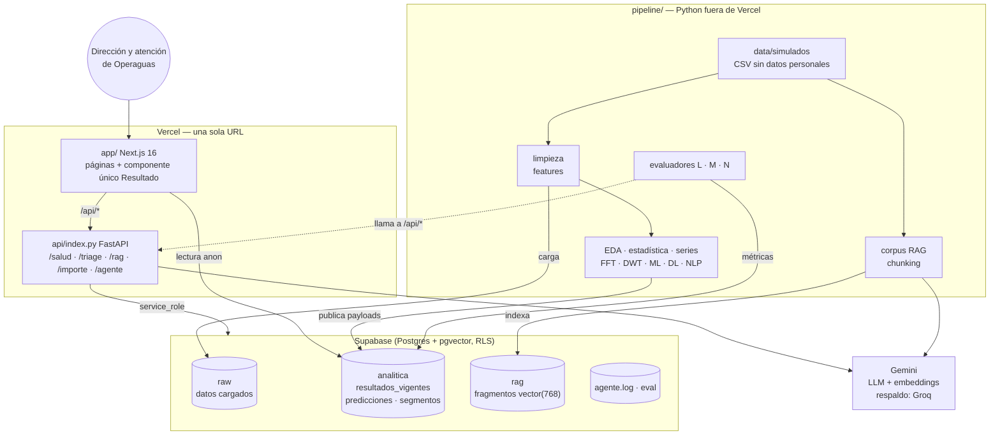

# Arquitectura

Operaguas Analítica es un solo proyecto de Vercel con dos partes (Next.js y
FastAPI) que leen de un Supabase alimentado por un pipeline de Python que corre
fuera de Vercel. Todo el cálculo de datos, ML e IA está en Python.

## Por qué cada pieza

| Pieza | Decisión | Motivo |
|---|---|---|
| `pipeline/` fuera de Vercel | El trabajo pesado (pandas, scikit-learn, PyTorch, PyWavelets) corre una vez y publica resultados | Las funciones de Vercel tienen límites de tamaño y tiempo; el evaluador ve el Python en el repo y en los notebooks |
| `analitica.resultados_vigentes` | Cada resultado es un `payload` JSON (tipo, título, datos, conclusión, fuente) | La app dibuja cualquier resultado con **un solo componente** y ningún número se escribe a mano (regla 5) |
| Predicción por lotes | `analitica.predicciones_pago` se calcula en el pipeline | La API no carga scikit-learn; responde en milisegundos |
| FastAPI en `api/` | Solo lo que depende de la pregunta del usuario: triage, RAG, agente, importe, salud | Lógica de IA en Python (regla 7) con validación Pydantic y errores en español |
| Next.js | Presenta; no calcula | ISR de 5 minutos: las páginas se regeneran solas cuando el pipeline publica una versión nueva |
| pgvector en Supabase | Índice del RAG junto a los datos | Un solo servicio de base de datos; RLS en todas las tablas |
| Gemini + Groq | Plan gratuito (D-11); Groq como respaldo solo del LLM | Sin costo; el respaldo evita que un límite de cuota tire el triage |

## Flujo de una consulta

1. **Página de resultados** (`/datos`, `/temporal`, `/modelos`, `/quejas`): Next.js lee
   `analitica.resultados_vigentes` con la llave pública (solo `SELECT`, RLS) y dibuja cada
   `payload` con `app/_componentes/Resultado.tsx`.
2. **Triage** (`POST /api/triage`): clasificador de T-14 (Python puro) → reglas declaradas de
   categoría y prioridad → el LLM redacta el resumen y señala riesgo (JSON validado; 1 reintento;
   respaldo Groq). Si el LLM falla, responde igual con `valido: false`.
3. **RAG** (`POST /api/rag`): embedding de la pregunta → Top-k en `rag.buscar_fragmentos` →
   si ninguna similitud supera el umbral, `evidencia: false` **sin llamar al LLM** → si hay
   evidencia, el LLM responde solo con los fragmentos y debe citarlos.
4. **Agente** (`POST /api/agente`): el LLM elige una herramienta por turno (JSON validado), el
   dispatcher valida argumentos y ejecuta, la observación vuelve al LLM; máximo 5 pasos; cada
   paso queda en `agente.log`.

## Límites conocidos

- **Plan gratuito:** Vercel Hobby (tiempo por función) y cuota de Gemini; el respaldo Groq y
  la pausa entre llamadas de los evaluadores lo mitigan.
- **Datos simulados:** reproducen la estructura de Operaguas, no su realidad; el generador no
  se conservó (T-00c) y la reproducibilidad parte de los CSV versionados.
- **Sin datos personales:** IDs cifrados; la API oculta correos y números largos antes del LLM.
- **Enrutamiento `/api/*`:** patrón de la plantilla oficial Next.js + FastAPI; verificado en
  producción con `/api/salud` (#71).
